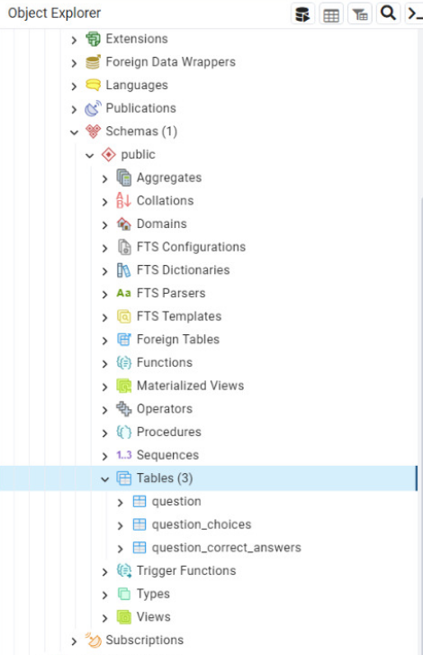
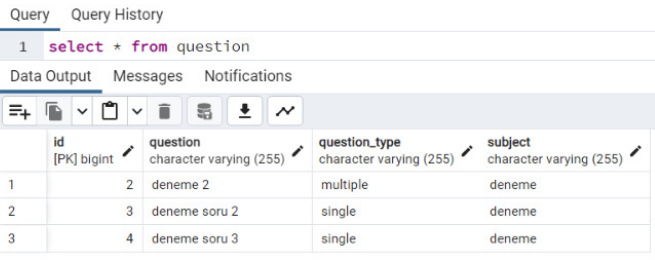
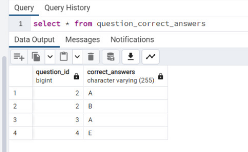
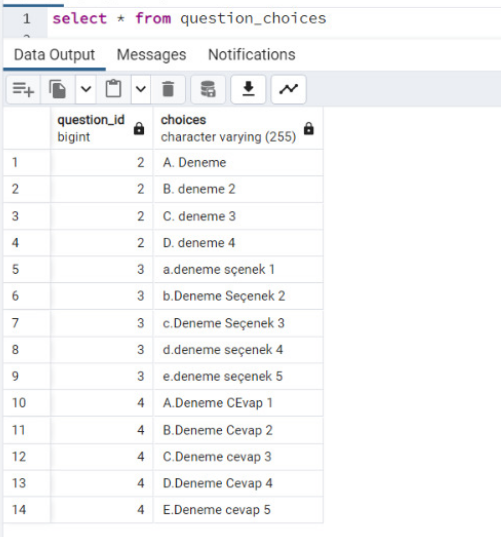
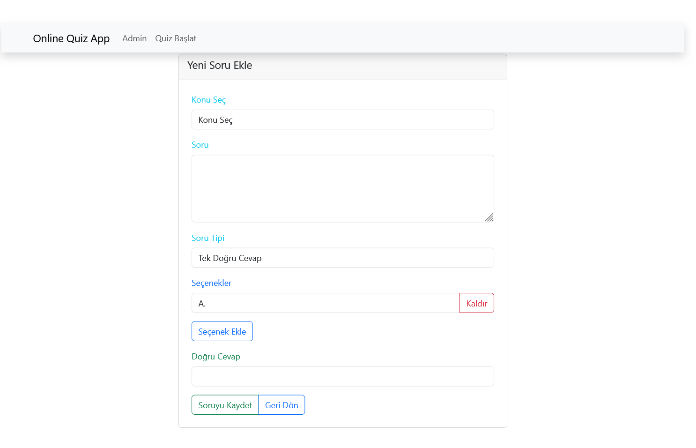
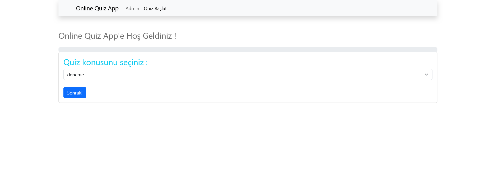
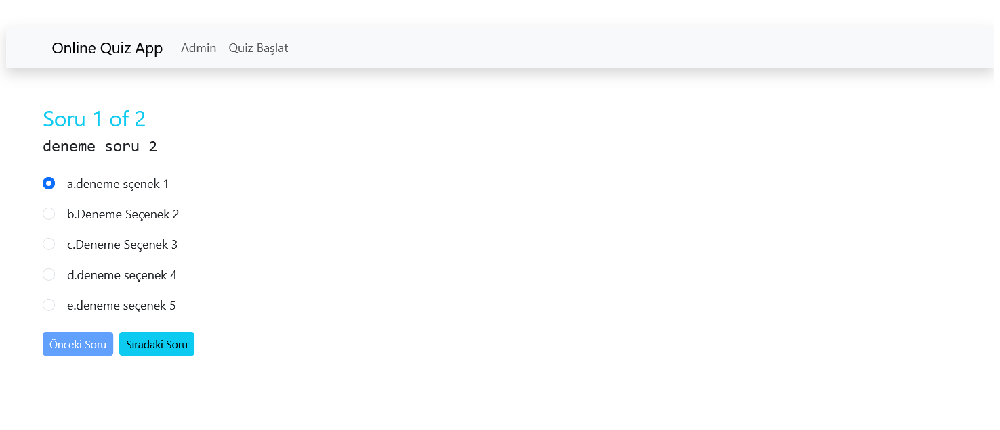
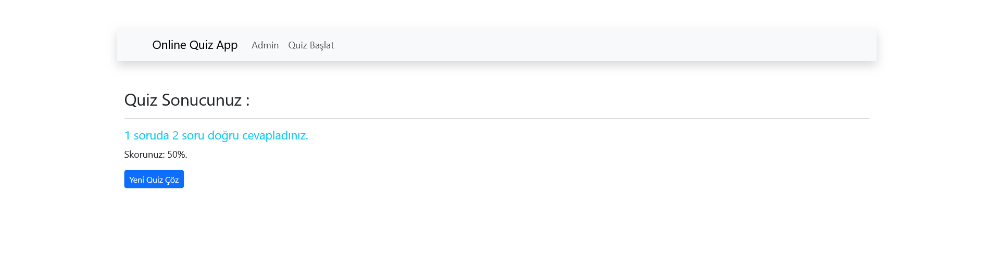

___
# Spring Boot and ReactJS Application
---

### Tech Stack

---
- Java
- Spring Boot
- Maven
- ModelMapper
- Lombok
- PostgreSQL
- Restful API
- ReactJS for frontend
- Bootstrap

### Run & Build

$ cd quiz-api
$ mvn clean install
$ mvn spring-boot:run

$ cd quiz-client
$ npm install
$ npm run dev

### Screenshots

